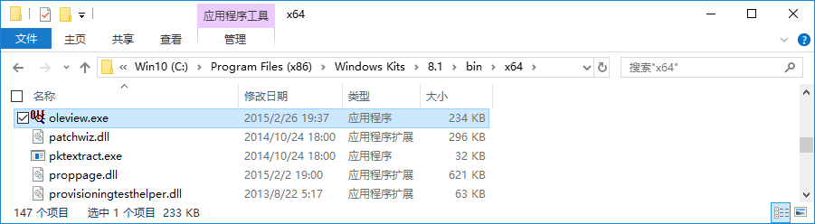
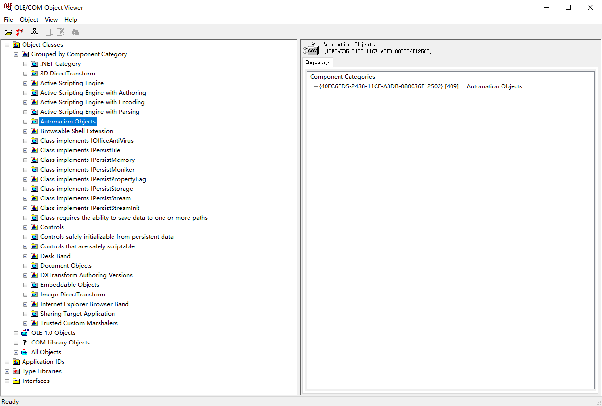
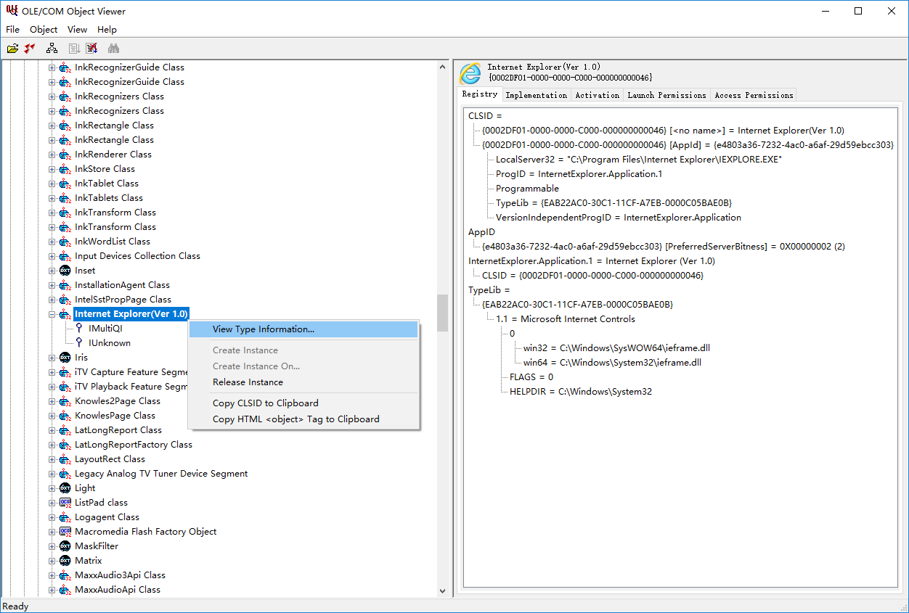
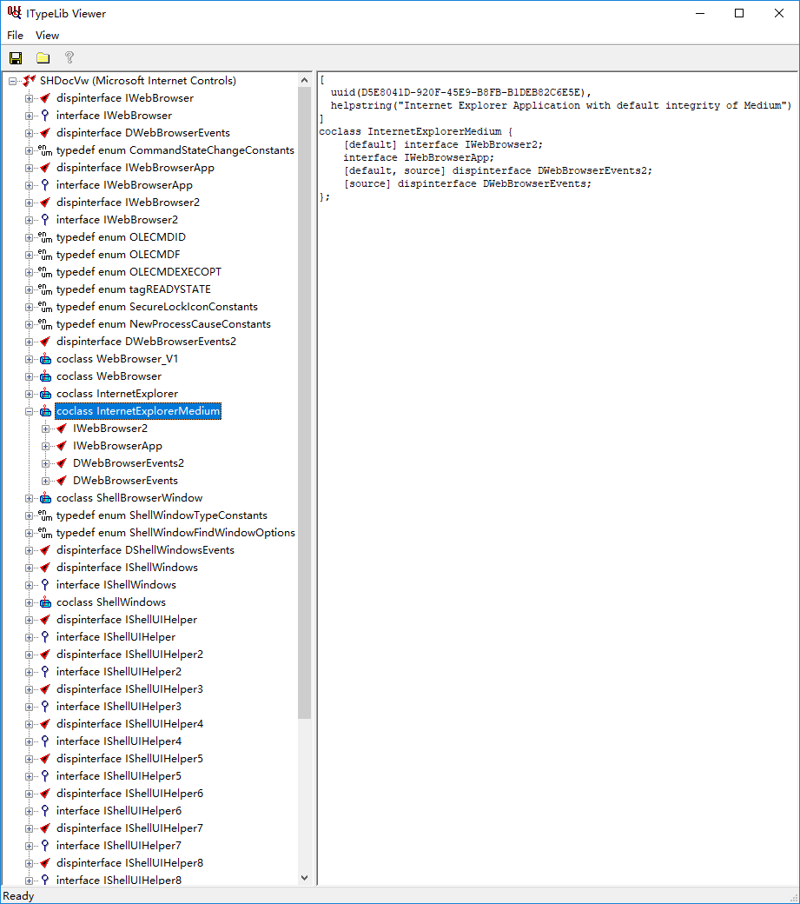
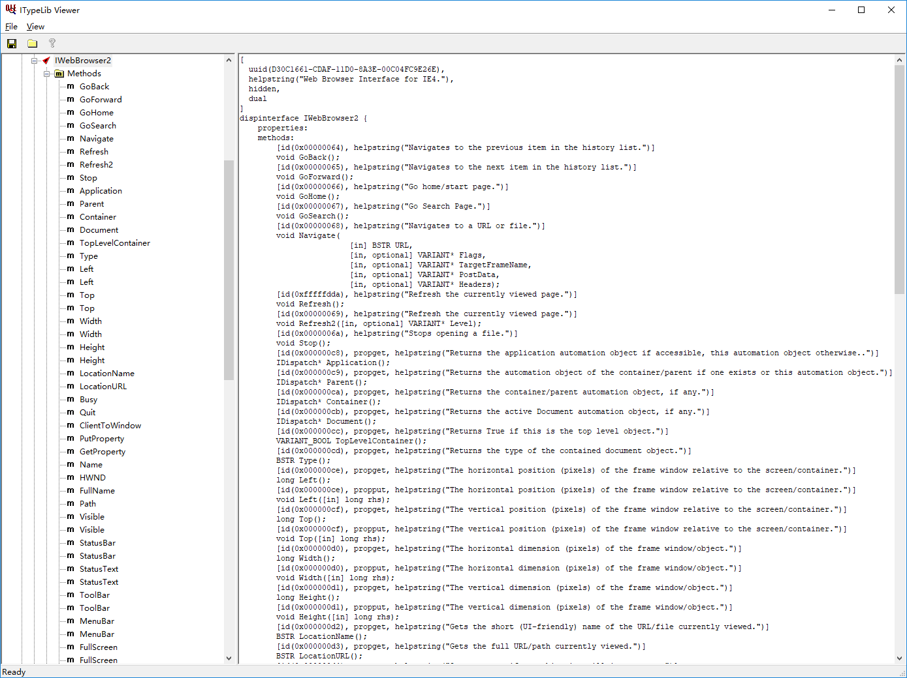
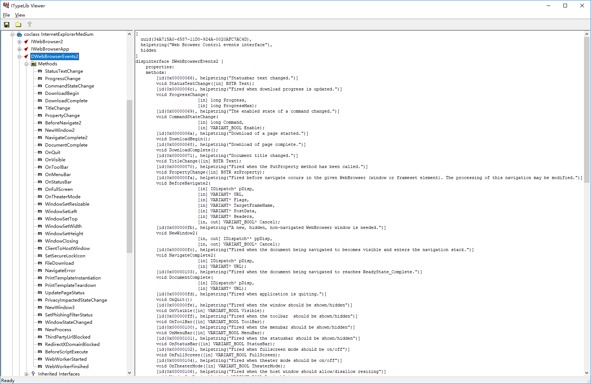

# Contributor guide

## Learn

Start with the document of [InternetExplorer object](https://msdn.microsoft.com/en-us/ie/aa752084), and go deep with **OLEView** (shown below).

 1. `oleview.exe` usually locates at `%ProgramFiles(x86)%\Windows Kits\8.1\bin\x64\`, and needs to run as administrator at the first time. 

 2. After opening the window of OLEView, open the path `Object Classes > Grouped by Component Category > Automation Objects > Internet Explorer(Ver 1.0)` of the tree at left of the window. 

 3. Right click `Internet Explorer(Ver 1.0)` on the tree, then select `View Type Information...` 

 4. After **ITypeLib Viewer** opened, all the interface of *Microsoft Internet Controls* are shown in a tree. 

 5. Members & events of **IE COM+ object** can be found in the tree, and the defination code of every item will be shown at right of the window when you click at left.  

## Develop

No [Babel](https://babeljs.io/) plugins with *Non-standard syntax*.

Please use an editor (or with a plugin) which supports [EditorConfig](http://editorconfig.org/#download).

## Debug

 - `npm test`: Silent testing

 - `npm run debug`: Connect with [Google Chrome DevTools](https://developers.google.com/web/tools/chrome-devtools/) and break at the first line of Testing script

## Commit

Before committing, you should execute `npm run build` manually, and then **check document changes** by `npm run help`.

You should commit all the files of changed document while committing modified source code.
